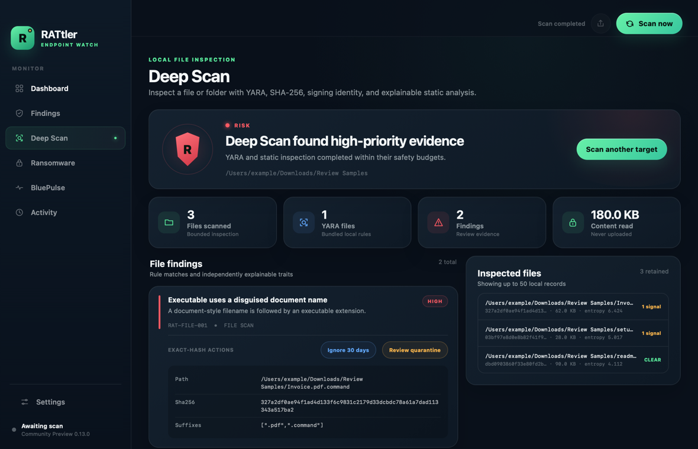
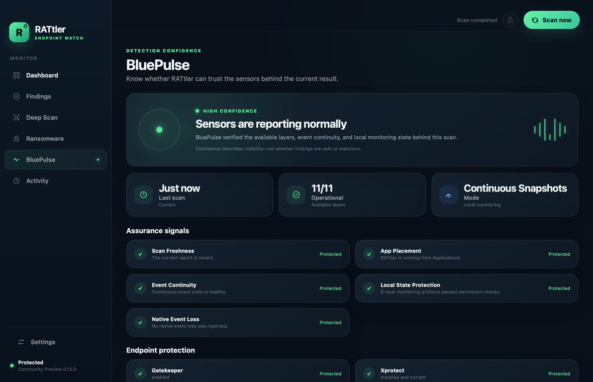
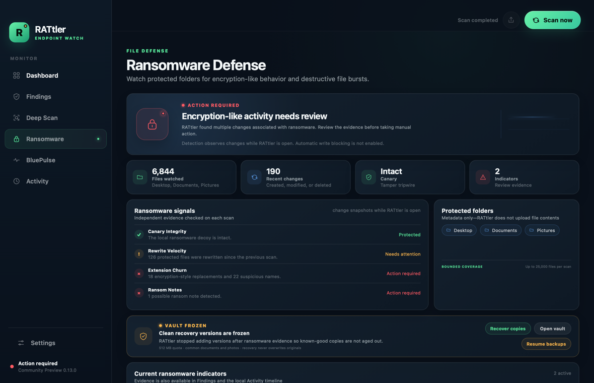
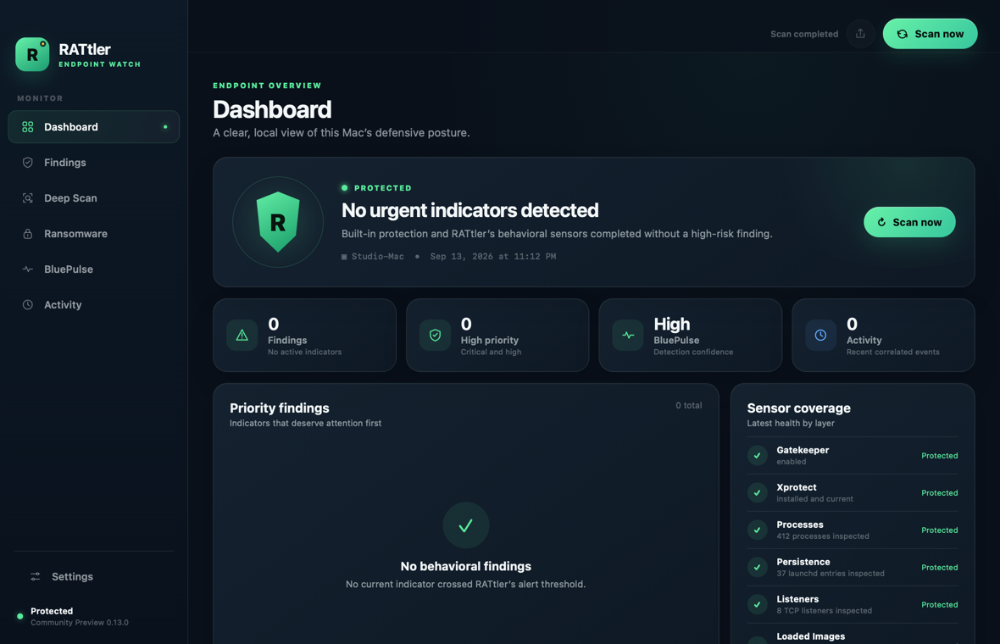
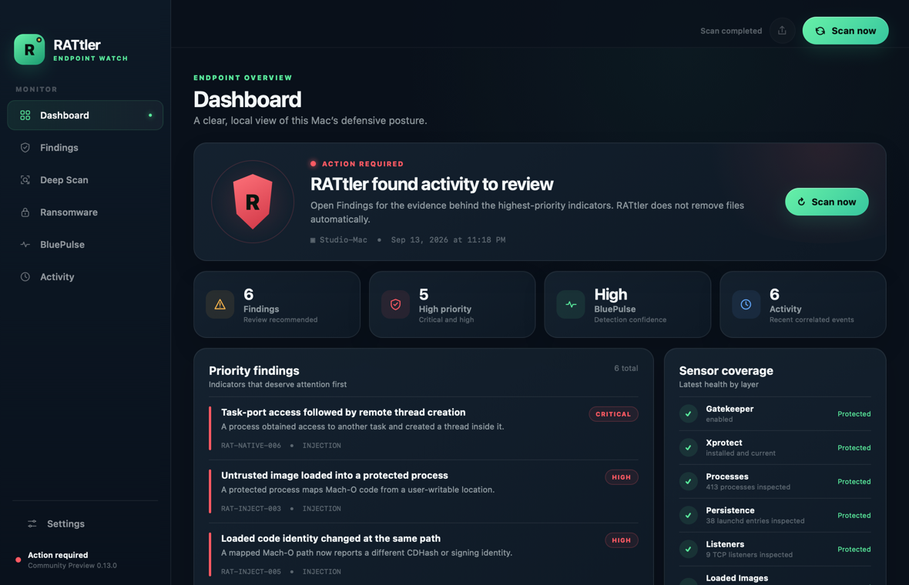

# RATtler

RATtler is a free, open-source anti-RAT monitor. It checks a Mac for suspicious
processes, persistence, network listeners, and loaded code. Everything stays on
the computer unless you export a report yourself.

> RATtler is a community preview, not a replacement for supported antivirus or
> EDR software. A finding means “review this,” not “this is definitely malware.”

## Download for macOS

Download **one ZIP**—not both:

- [Mac with an Apple chip](https://github.com/VulneraDev/RATtler/releases/download/v0.13.0/RATtler-macOS-Apple-Silicon.zip)
- [Mac with an Intel processor](https://github.com/VulneraDev/RATtler/releases/download/v0.13.0/RATtler-macOS-Intel.zip)

Not sure which Mac you have? Open **Apple menu → About This Mac**:

- If it says **Chip: Apple M1, M2, M3, M4, or newer**, choose Apple chip.
- If it says **Processor: Intel**, choose Intel.

The small `.sha256` downloads on the release page are optional verification
files. Most people only need the ZIP.

## Install

1. Open the downloaded ZIP.
2. Open Finder and choose **Downloads**.
3. Drag `RATtler.app` onto **Applications** in Finder’s sidebar.
4. Open **Applications** and double-click RATtler.
5. If macOS blocks it, open **System Settings → Privacy & Security**, scroll to
   **Security**, and click **Open Anyway**.
6. Enter your Mac password and click **Open**.

RATtler is not Apple-notarized yet, which is why the one-time warning appears.
Do not disable Gatekeeper globally.

## Run your first scan

RATtler scans automatically when it opens. You can also click **Scan now**.

- **Protected** means no urgent indicator was found with the available sensors.
- **Action required** means something deserves review. It is not a malware
  verdict.
- Open **Findings** to see the exact process or file path and the reason.
- Only use **Review quarantine** after you recognize and verify the exact file.

If RATtler says it is running from Downloads, close it, drag it into
**Applications**, and reopen it there. RATtler excludes its exact app and
scan-engine process IDs so it does not flag itself.

## Deep Scan

Open **Deep Scan**, choose one file or folder, and review the result. This is a
content scan: RATtler reads only the files you selected, locally, to calculate
SHA-256, apply the bundled YARA rules, inspect Mach-O signing identity, and
explain suspicious static traits. Nothing is uploaded.

Scans are capped at 2,000 files, 64 MiB per file, 512 MiB total, and 120
seconds. Symbolic links are not followed. A rule match is review evidence, not
a malware verdict; the result shows the exact rule source and SHA-256 so it can
be reproduced.
Eligible results can be ignored for 30 days only by binding the exception to
that exact rule, path, and file hash, or sent through RATtler's reviewed manual
quarantine flow.



## BluePulse

BluePulse answers: **“Can I trust the sensors behind this result?”** It keeps
detection confidence separate from threat severity. A scan can therefore show
a real threat with high confidence, or no threat while warning that visibility
is incomplete.

It checks whether available protection and behavioral sensors replied, whether
the report is fresh, whether event state is continuous, whether local monitoring
files have safe permissions, and whether native telemetry reported a heartbeat
or dropped events. Optional native telemetry and integrity baselines are clearly
labeled when they are not configured; their absence is not presented as failure.



## Ransomware Defense

The **Ransomware** tab watches file metadata in Desktop, Documents, and Pictures
for changes commonly associated with encryption attacks. It detects bursts of
file rewrites, encryption-style extension replacements, possible ransom-note
filenames, mass deletion, and modification of a harmless local canary.

Monitoring is local, bounded to 25,000 files, and runs on each scan while
RATtler is open. RATtler does not read or upload protected-file contents. This
release detects and explains suspicious changes. Kernel-mediated write blocking
still requires Apple's restricted Endpoint Security entitlement.

### Recovery Vault

Choose **Enable vault** in the Ransomware tab to keep versioned recovery copies
of common documents and photos. The vault is opt-in, private to the current Mac,
limited to 512 MB, and retains up to three versions per eligible file. After a
ransomware finding, RATtler freezes automatic backups so clean versions are not
aged out.

**Recover copies** verifies the stored objects and creates a new timestamped
folder on the Desktop. It never overwrites, deletes, or silently replaces the
original files. Recovery is intentionally separate from detection because the
vault reads eligible file contents only after the user opts in.



## Screenshots

These use safe synthetic data; no malware was installed to create them.

Healthy endpoint:



Risk detected:



## What RATtler checks

- Processes launched from temporary, download, cache, or deleted locations
- Suspicious LaunchAgents and LaunchDaemons
- `DYLD_INSERT_LIBRARIES` and `LD_PRELOAD` persistence
- TCP services exposed on every network interface
- Deleted or untrusted Mach-O code loaded into protected processes
- Code-signing, Team ID, and CDHash identity changes
- Selected files and folders with bundled YARA rules, SHA-256, Mach-O signing,
  disguised executable names, and high-entropy executable context
- Snapshot process ancestry with start-time identities that resist ordinary PID
  reuse during event correlation
- Executable code running from randomized App Translocation paths
- Ransomware-style bulk rewrites, extension churn, ransom notes, mass deletion,
  and local canary damage
- Opt-in, quota-limited, content-addressed recovery copies with automatic freeze
  on ransomware evidence
- BluePulse sensor confidence, scan freshness, state permissions, and event loss
- Gatekeeper and XProtect health on macOS
- Microsoft Defender health on Windows
- ClamAV availability on Linux and other Unix systems
- Native memory, task-port, tracing, and remote-thread events when Apple’s
  restricted Endpoint Security entitlement is provisioned

## Quarantine and restore

Quarantine is always manual. RATtler first shows the exact path and SHA-256,
then asks for confirmation. It moves the file into private local storage and
removes execute permission; it does not delete the file or stop a process that
is already running.

Open **Settings → Response** to view or restore quarantined files. Restore checks
the file again and never overwrites an existing destination.

## Reviewed exceptions

Eligible code-identity findings offer **Ignore 30 days** after you expand them.
RATtler asks for native confirmation and binds the exception to the exact rule,
absolute path, and either a CDHash, SHA-256, or Team ID plus signing identifier.
Path-only allowlisting is refused, exceptions expire automatically, and matching
activity remains visible in the local timeline. Manage active exceptions in
**Settings → Reviewed exceptions**.

Exception policy files are private to the current user, not tamper-proof against
malware already running as that user. Root-owned policy enforcement remains part
of the future signed system-extension milestone.

## Privacy and safety

- No account is required.
- The app contains no telemetry upload or remote-control service.
- Reports and response history stay in
  `~/Library/Application Support/RATtler`.
- Local reports may contain executable paths, signing identifiers, Team IDs,
  and CDHashes so a finding can be investigated without guessing code identity.
- RATtler never quarantines automatically.
- The current Endpoint Security collector is detection-only.
- Deep Scan reads the contents of only the file or folder an operator selects;
  it is bounded, stays local, and does not follow symbolic links.
- Ransomware monitoring records file paths, size, modification time, and inode
  locally; it does not inspect protected-file contents.
- Recovery Vault reads eligible document and photo contents only after explicit
  opt-in and stores them locally under Application Support.
- BluePulse is tamper-evident within the app’s current permissions; it is not a
  substitute for the planned signed system extension and root-owned state.

## Update or remove RATtler

To update, quit RATtler, download the newest ZIP, and replace the old app in
Applications.

To remove it, quit RATtler and drag it from Applications to Trash. Its local
history remains in `~/Library/Application Support/RATtler`; delete that folder
only if you also want to remove reports, baselines, and quarantined files.

## Developers

Python, CLI, Deep Scan, baseline, event-correlation, quarantine, recovery, and
safe-canary commands are in the [CLI guide](docs/CLI.md). Build and packaging
instructions are in the [macOS app guide](app/macos/README.md). Native sensor
provisioning is in the [Endpoint Security guide](native/macos/README.md).

```sh
python3 -m pip install -e '.[yara]'
rattler --pretty
rattler files scan ~/Downloads --rules rules --pretty
PYTHONPATH=src python3 -m unittest discover -s tests -v
```

RATtler’s staged prevention, system-extension, tamper-evidence, fleet, and
next-generation detection plans are documented in the
[response roadmap](docs/ROADMAP.md).

Contributions are welcome under the MIT license. See
[`CONTRIBUTING.md`](CONTRIBUTING.md).
